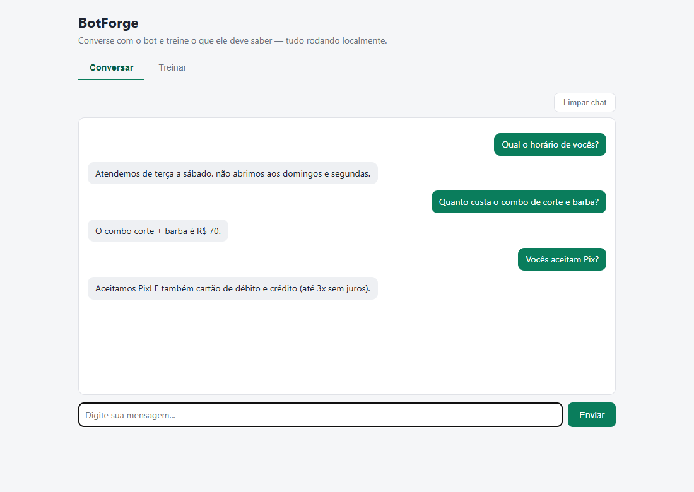
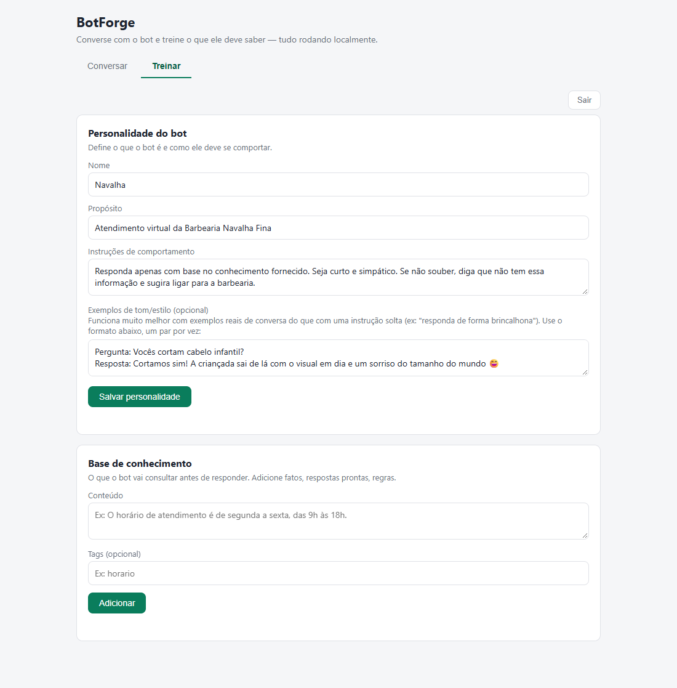

# BotForge

Chatbot que roda **100% local**: um LLM open source (Llama 3.2 3B via [LLamaSharp](https://github.com/SciSharp/LLamaSharp)) que responde com base numa **base de conhecimento treinada pelo próprio usuário**, sem depender de nenhuma API de IA na nuvem. Você define a personalidade do bot, alimenta o que ele deve saber e conversa com ele — tudo pela mesma tela, no seu computador.

## Telas

**Conversa** — o bot responde usando só o que foi treinado (aqui, uma barbearia fictícia):



**Treino** — personalidade do bot e base de conhecimento, em uma área protegida por login:



## Como funciona

1. **Treino**: cada item de conhecimento cadastrado tem o seu texto convertido em um *embedding* (vetor) pelo próprio modelo local e é salvo no banco.
2. **Pergunta**: a mensagem do usuário também vira um embedding e é comparada por **similaridade de cosseno** com toda a base; os 4 itens mais relevantes entram no prompt (RAG simples, sem banco vetorial externo).
3. **Prompt**: o `PromptBuilder` monta o contexto com o nome, o propósito e as instruções do bot, o conhecimento recuperado e o tom de voz.
4. **Tom de voz**: exemplos no formato `Pergunta: ... / Resposta: ...` são convertidos em turnos de conversa reais (*few-shot*), o que funciona bem melhor com modelos pequenos do que uma instrução solta como "seja divertido".
5. **Resposta**: o modelo gera a resposta com o template de chat nativo do Llama 3, considerando também as últimas 6 mensagens da conversa (persistidas em SQLite).
6. **Limpar conversa**: pedidos em texto livre como "esquece nossa conversa" são detectados por regex — mais rápido e mais confiável do que depender do LLM para interpretar isso como comando.

## Stack

- **Backend**: C# / .NET 10, ASP.NET Core Web API, Entity Framework Core
- **LLM local**: LLamaSharp 0.27 (backend CPU), Llama 3.2 3B Instruct quantizado (Q4_K_M)
- **Banco**: SQLite (arquivo local, criado automaticamente no primeiro start)
- **Frontend**: uma página HTML/JS pura servida pela própria API, sem build

## Como executar

Só precisa do .NET SDK. Na primeira execução, se o modelo (`.gguf`, cerca de 2 GB) não estiver na máquina, a aplicação baixa sozinha antes de subir o servidor, com progresso no log.

```bash
dotnet run --project src/BotForge.Api
```

Depois é só abrir `http://localhost:5275`. Sem GPU obrigatória: o padrão roda em CPU (`GpuLayerCount: 0`).

### Configuração

Tudo em `src/BotForge.Api/appsettings.json`:

| Chave | Para que serve |
|---|---|
| `LlamaSharp:ChatModelPath` | Caminho do modelo `.gguf` |
| `LlamaSharp:ModelDownloadUrl` | De onde baixar o modelo se ele não existir |
| `LlamaSharp:ContextSize` / `GpuLayerCount` | Tamanho do contexto e camadas na GPU |
| `BotForge:ApiKey` | Se preenchida, exige o header `X-Api-Key` nas rotas da API (a página web continua livre). Vazia = desativado |
| `BotForge:TrainingAuth` | Usuário e senha (Basic Auth) da área de treino |

> As credenciais de treino em `appsettings.json` são valores de desenvolvimento. Troque antes de expor a aplicação fora da sua máquina.

## API

| Rota | Descrição | Protegida por login de treino |
|---|---|---|
| `POST /chat` | Envia uma mensagem (`conversationId`, `message`) e recebe a resposta | Não |
| `DELETE /chat/{conversationId}` | Apaga o histórico da conversa | Não |
| `GET/POST/PUT/DELETE /knowledge` | CRUD da base de conhecimento | Sim |
| `GET/PUT /profile` | Lê e atualiza a personalidade do bot | Sim |

## Arquitetura

Camadas clássicas, com o domínio sem nenhuma dependência de infraestrutura:

```
BotForge.Api             -- Controllers, middlewares (API key e login de treino), página web
BotForge.Application      -- ChatService, TrainingService, ProfileService, PromptBuilder, contratos
BotForge.Domain            -- Entidades (BotProfile, KnowledgeItem, Conversation, Message)
BotForge.Infrastructure    -- EF Core + SQLite, repositórios, cliente LLamaSharp, download do modelo
```

A `Application` só conhece a interface `ILlmClient`; a implementação com LLamaSharp vive na `Infrastructure`, então trocar o motor de LLM não toca nas regras de negócio.

## Decisões de projeto

- **Local-first**: sem chave de API, sem custo por token e sem dado saindo da máquina.
- **RAG sem banco vetorial**: para a escala de uma base de conhecimento pessoal ou de um pequeno negócio, guardar os embeddings no SQLite e comparar por cosseno em memória é suficiente e elimina uma dependência de infraestrutura.
- **Dois modelos carregados (chat e embedding)**: o `PoolingType` é uma configuração de carga do modelo e é incompatível com o contexto de chat, então o mesmo arquivo é carregado duas vezes com parâmetros distintos.
- **Robustez para modelos pequenos**: geração com seed aleatória, nova tentativa quando a resposta vem vazia e remoção de rótulos de papel indevidos ("Resposta:", "Atendente:") no início do texto.
